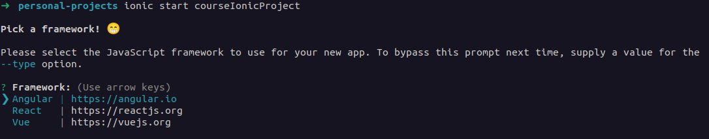
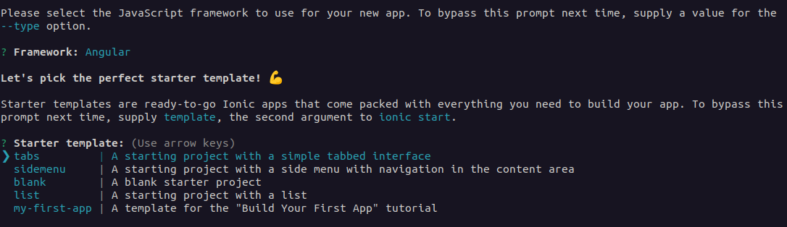
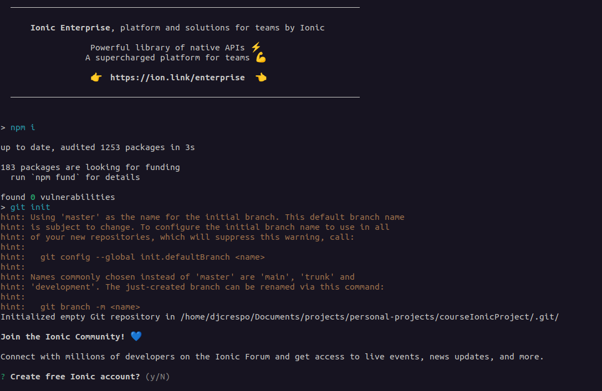

# Introducción

## ¿Qué es Ionic?

Es un kit de herramientas open-source para crear aplicaciones móviles a través de tecnologías web (HTML, CSS y JavaScript); esto a través de los frameworks populares como Angular React y Vue.

## Requerimiento

- Usar un entorno con Linux o Mac
  - Se puede usar windows pero no es recomendado
- Node js
  - Instalar node
    - Linux → Node Version Manager

    - Abrir terminal
    - Copiar la siguiente línea

        ```bash
        curl -o- https://raw.githubusercontent.com/nvm-sh/nvm/v0.39.2/install.sh | bash
        ```

    - Añadir comando *nvm* a la terminal
      - Puede que sea (`~/.bash_profile`, `~/.zshrc`, `~/.profile` ó `~/.bashrc`).

        ```bash
        export NVM_DIR="$([ -z "${XDG_CONFIG_HOME-}" ] && printf %s "${HOME}/.nvm" || printf %s "${XDG_CONFIG_HOME}/nvm")"
        [ -s "$NVM_DIR/nvm.sh" ] && \. "$NVM_DIR/nvm.sh"
        ```

    - Actualizar configuración

        ```bash
        source ~/.bashrc
        ```

    - Ver versiones disponibles

        ```bash
        nvm list-remote
        ```

    - Escogemos la versión más reciente

        ```bash
        nvm install v16.18.0
        ```

    - Verificamos que esté por *default* la versión que escogimos

        ```bash
        nvm list
        ```

    - Mac → Instalar a través del .pkg installer
      - Descargamos el instalador en la página oficial
      - Le damos continuar con la instalación
        - Le damos los permisos que nos pide
      - Terminamos la instalación
    - Windows → Instalar a través del .exe
      - Descargamos el instalador en la página oficial
      - Le damos continuar con la instalación
        - Le damos los permisos que nos pide
      - Terminamos la instalación
  - Verificar Node
    - Abrimos nuestra terminal
      - cmd → Windows
      - Terminal → Mac
      - Bash → Linux
    - Y verificamos Node con el siguiente comando
      - Verificar Node Js

        ```bash
        node -v
        ```

      - Verificar npm

        ```bash
        npm -v
        ```

- Visual Studio Code
  - Descargamos el instalador desde la página
  - La instalamos y abrimos el programa
- Ionic CLI
  - Linux y Mac

    ```bash
    sudo npm -i -g @ionic/cli
    ```

## Diferencias con otras alternativas

Existen varias lenguajes y frameworks para programar aplicaciones móviles. Ha día de hoy existen dos formas de programar para dispositivos móviles, ya sea a través de lenguajes **Natívos** o de manera **Híbirida**.

De forma nativa, para programar en Android podemos usar 2 lenguajes de programación

- Java
- Kotlin

Y para dispositivos apple tenemos:

- Swift

Si bien estos lenguajes de programación nos permiten hacer muchas cosas directamente con el *hardware* del dispositivo y tener un mayor control, la curva de aprendizaje suele ser grande y también implica desarrollar **2** apps para cada entorno, que implica un mayor coste para el equipo.

Si bien programar de forma nativa es lo más ideal si queremos que nuestra aplicación sea robusta y permita hacer cosas complejas, en algunos casos no requerimos todo esto y más si tenemos presente el costo-tiempo para el desarrollo de la misma, es por eso que lo ideal sería optar por la alternativa de programar de manera **híbrida**, esto a través de frameworks como:

- Ionic
- React Native
- Futtler
- NativeScript
- Xamarin

Estos frameworks nos ofrecen librerías que se comunican al dispositivo, si bien a día de hoy podemos hacer la mayoría de lo que necesitamos con desarrollo híbrido, existen algunas limitantes en estas como la integración del SDK de terceros en nuestra aplicación o cosas más complejas que requieren a lo mejor control más avanzado de los recursos.

##  Hola mundo

Para crear nuestro primer proyecto en Ionic necesitamos abrir la terminal e ingresar lo siguiente:

Creamos una carpeta donde tendrá todos nuestros proyectos

```bash
mkdir projects
```

Y la abrimos

```bash
cd projects
```

Dentro de nuestra carpeta vamos a ejecutar el siguiente comando:

```bash
ionic start <nombreProjecto>
```

Dentro del proceso nos pedirá confirmar ciertas cosas dentro de nuestro proyecto, como el framework a usar (Vue, React o Angular), tipo de plantilla, entre otros.



Una vez que escojamos nuestro framework a trabajar nos pedirá que elijamos una plantilla para el proyecto.



Se instalarán las liberías de nuestro proyecto como "Capacitor" y otros más, al finalizar nos pregunta si queremos crear una cuenta dentro de sus servicios, podemos omitirlo y listo, tendremos nuestro proyecto listo.



Nos creará una carpeta y podremos abrirla dentro de nuestro editor favorito:

- Visual Studio Code

```bash
code <nombreProjecto>
```

- Fleet

```bash
fleet <nombreProjecto>
```

- WebStorm

```bash
webstorm <nombreProjecto>
```
